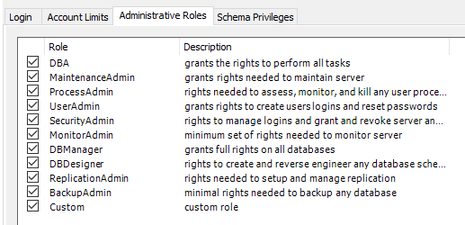
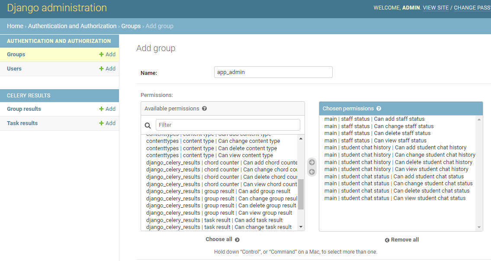
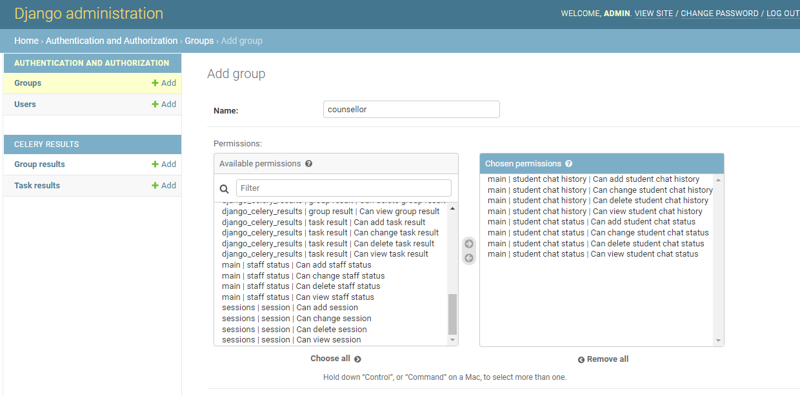
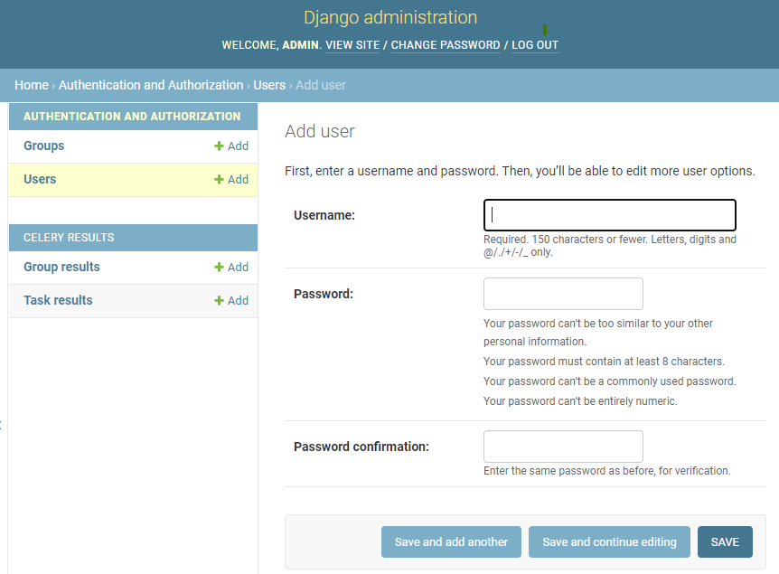
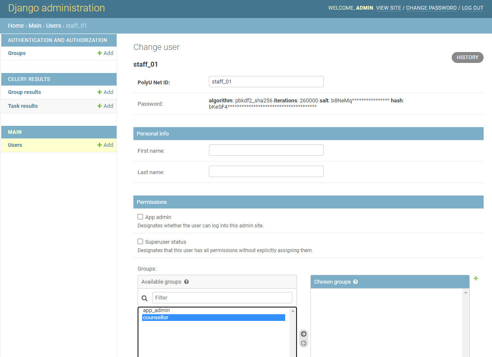

1. Deploy Django server
   
    Put `.env.docker` file with all your environment variables under the same directory with `docker-compose.yml`.
    Please don't push `.env.docker` file to this repo.
    Build django server first.
    ```shell
    docker-compose up -d --build django
    ```

    Stop Django and move to next step.
    ```shell
    docker-compose stop django
    ```

2. Create Database/ Database Migration
   
   Database creation and migration should be done manually after test.
   Otherwise, incompatible changes may arise and may need to reset.

   ```shell
   cd chatbot_demo
   ```
    
   Create virtual environment if not exist.
   ```shell
   python -m venv venv
   source venv/bin/activate
   pip install -r requirements.txt
   ```
   
   `manage_cli.py` serve as a proxy to run django cli. 
   It loads the environment variable from `.env.docker` before run your command.
   
   ```shell
   # Generate migration scripts
   ./manage_cli.py makemigrations
   
   # Execute migration scripts
   ./manage_cli.py migrate
   
   # Rollback to certain migration step
   ./manage_cli.py migrate <app_name> <migration name>
   ./manage_cli.py migrate main 0005_previous_migration
   ```
   
   Other useful commands:
   
   [reversing-migrations](https://docs.djangoproject.com/en/3.2/topics/migrations/#reversing-migrations)
   
   [squashmigrations](https://docs.djangoproject.com/en/3.2/topics/migrations/#migration-squashing)
   
3. Enable Server Side Encryption

   Run the SQL [enable_TDE.sql](https://github.com/chenbingxiayu/chatbot-demo/blob/master/enable_TDE.sql) in the project root directory

5. Grant privilege to db user
    
    Get into mysql and grant `MYSQL_USER` DBA role
   
   
   
6. Create superuser for django server
   
   Please create and activate virtual environment before running the following  
   ```shell
   cd chatbot_demo
   ./manage_cli.sh createsuperuser
   
   # Run test if needed
   ./manage_cli.sh test tasks.tests
   ./manage_cli.sh test main.tests.test_login
   
   # After creating superuser successfully
   cd ../
   docker-compose up -d --build django
   ```
   Login [admin_page](http://localhost:8899/admin/) with the superuser you just created.


5. Add User Group
   
   We will add three user groups, `app_admin`, `supervisor` and `counsellor`.
   
   `administrator` will be granted `app_admin`.
   
   `supervisor` will be granted `supervisor`.
   
   `online triage`, `DO` and `counsellor` will be granted `counsellor`. 

   app_admin
   
   
   counsellor
   

6. Add Staff User
   
   Add staff
   
   
   Assign group to users (access rights)
   
   
7. Run All service

   ```shell
   # Deploy backend only
   docker-compose up -d --build django celery celery_beat
   # mysql is for local development use, while flower is optional to run.
   
   # Deploy frontend and backend
   ./deploy.sh
   ```
   
   