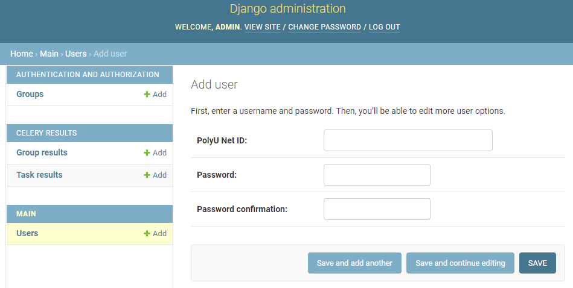

1. Deploy Django server 
   
    Put `.env.docker` file with all your environment variables under the same directory with `docker-compose.yml`.
    Please don't push `.env.docker` file to this repo.
    Build django server first.
    ```shell
    docker-compose up -d --build django
    ```
    Then the database will be created together with the user defined by `MYSQL_USER`.

    Stop Django and move to next step.
    ```shell
    docker-compose stop django
    ```


2. Grant privilege to db user
    
    Get into mysql and grant `MYSQL_USER` DBA role
   
   
   

3. Create superuser for django server

   ```shell
   cd chatbot_demo
   ./manage_cli.sh createsuperuser
   
   # Run test if needed
   ./manage_cli.sh test tasks.tests
   ./manage_cli.sh test main.tests.test_login
   
   # After creating superuser successfully
   cd ../
   docker-compose up -d --build django
   ```
   Login [admin_page](http://localhost:8899/admin/) with `PolyU Net ID=admin` and `Password=admin`


4. Add User Group
   
   We will add two user groups, `app_admin` and `counsellor`.
   `administrator` and `supervisor` will be granted `app_admin`. 
   `online triage`, `DO` and `counsellor` will be granted `counsellor`. 

   app_admin
   
   
   counsellor
   

5. Add Staff User
   
   Add staff
   
   
   Assign user group (assign rights)
   
   
6. Run All service

   ```shell
   docker-compose up -d --build
   ```